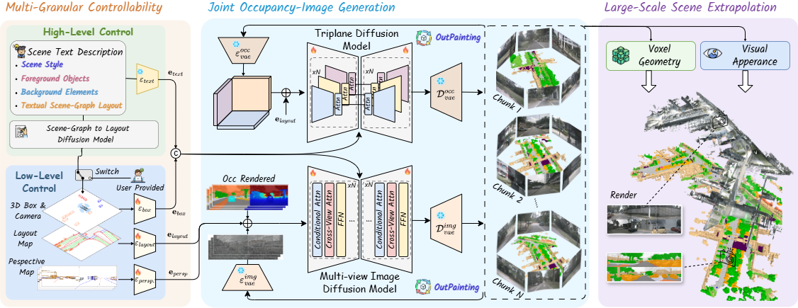
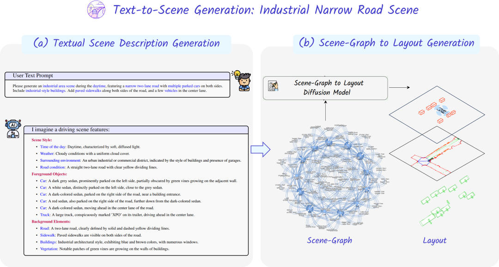
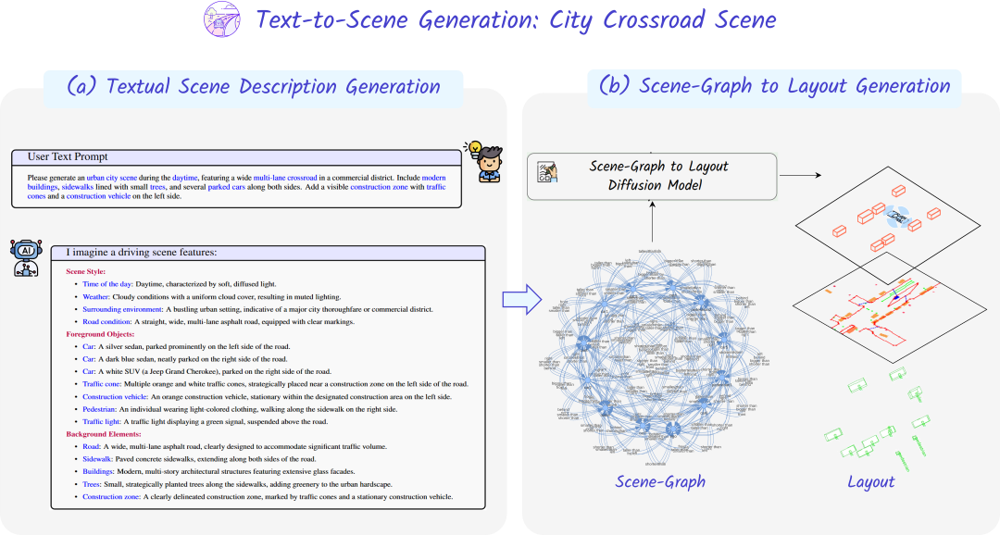
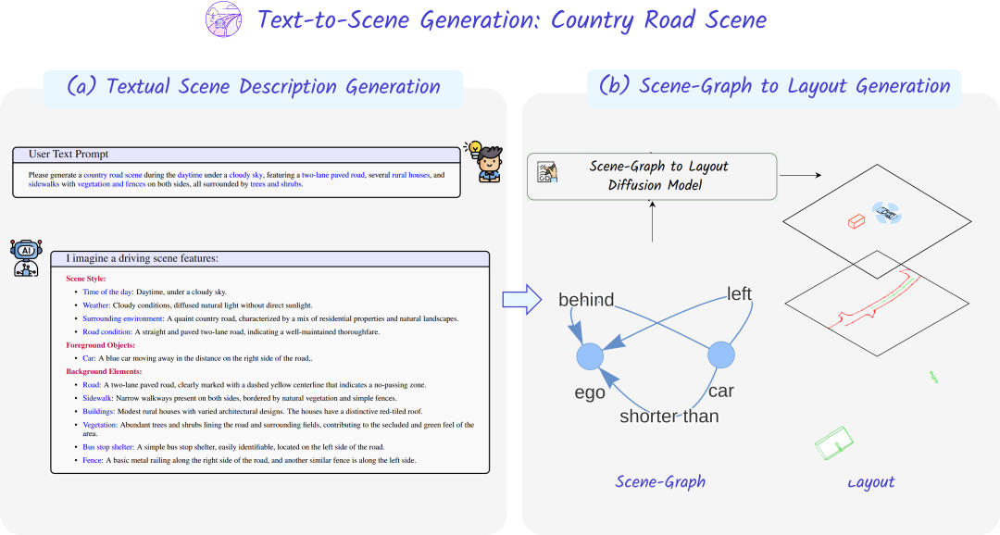
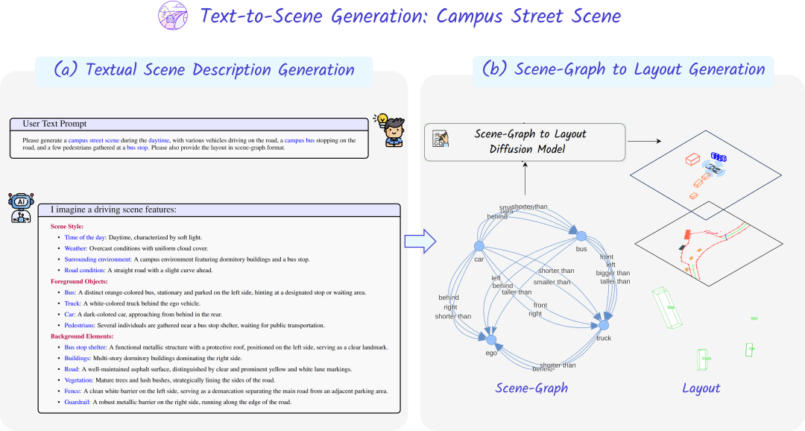

  
  <h1>
    𝒳-Scene: Large-Scale Driving Scene Generation with High Fidelity and Flexible Controllability
  </h1>




## Abstract

Diffusion models are advancing autonomous driving by enabling realistic data synthesis, predictive end-to-end planning, and closed-loop simulation, with a primary focus on temporally consistent generation. However, the generation of large-scale 3D scenes that require spatial coherence remains underexplored.

In this paper, we propose 𝒳-Scene, a novel framework for large-scale driving scene generation that achieves both geometric intricacy and appearance fidelity, while offering flexible controllability.

Specifically, 𝒳-Scene supports multi-granular control, including low-level conditions such as user-provided or text-driven layout for detailed scene composition and high-level semantic guidance such as user-intent and LLM-enriched text prompts for efficient customization.

To enhance geometrical and visual fidelity, we introduce a unified pipeline that sequentially generates 3D semantic occupancy and the corresponding multiview images, while ensuring alignment between modalities. 

Additionally, we extend the generated local region into a large-scale scene through consistency-aware scene outpainting, which extrapolates new occupancy and images conditioned on the previously generated area, enhancing spatial continuity and preserving visual coherence.

The resulting scenes are lifted into high-quality 3DGS representations, supporting diverse applications such as scene exploration.

Comprehensive experiments demonstrate that 𝒳-Scene significantly advances controllability and fidelity for large-scale driving scene generation, empowering data generation and simulation for autonomous driving.

## Method

  

  

  Pipeline of 𝒳-Scene for scalable driving scene generation: <strong>(a) Multi-granular controllability</strong> supports both high-level text prompts and low-level geometric constraints for flexible specification;  <strong>(b) Joint occupancy-image generation</strong> synthesizes aligned 3D voxels and multi-view images via conditional diffusion; <strong>(c) Large-scale extrapolation and reconstruction</strong> enables coherent scene expansion through consistency-aware outpainting.
  

## Scene Generation Results

### 1. Layout Conditioned Generation

  

    <video class="video-normal" autoplay loop muted playsinline preload="metadata">
      <source src="assets/images/generation_1.webm" type="video/webm">
    </video>
  

  

    <video class="video-normal" autoplay loop muted playsinline preload="metadata">
      <source src="assets/images/generation_2.webm" type="video/webm">
    </video>
  

### 2. Text-to-Scene Generation
<!-- 

  

    
    <video class="video-medium" autoplay loop muted playsinline preload="metadata">
      <source src="assets/images/text2scene_1_2.webm" type="video/webm">
    </video>
  

  

    
    <video class="video-medium" autoplay loop muted playsinline preload="metadata">
      <source src="assets/images/text2scene_2_2.webm" type="video/webm">
    </video>
  

  

    
    <video class="video-medium" autoplay loop muted playsinline preload="metadata">
      <source src="assets/images/text2scene_3_2.webm" type="video/webm">
    </video>
  

  

    
    <video class="video-medium" autoplay loop muted playsinline preload="metadata">
      <source src="assets/images/text2scene_4_2.webm" type="video/webm">
    </video>
  

 -->

  <button class="toggle-btn active" onclick="showScene(1)">Scene 1</button>
  <button class="toggle-btn" onclick="showScene(2)">Scene 2</button>
  <button class="toggle-btn" onclick="showScene(3)">Scene 3</button>
  <button class="toggle-btn" onclick="showScene(4)">Scene 4</button>

  

    <video class="video-normal" autoplay loop muted playsinline preload="metadata">
      <source src="assets/images/text2scene_1_1.webm" type="video/webm">
    </video>
    <video class="video-normal" autoplay loop muted playsinline preload="metadata">
      <source src="assets/images/text2scene_1_2.webm" type="video/webm">
    </video>
  

  

    <video class="video-normal" autoplay loop muted playsinline preload="metadata">
      <source src="assets/images/text2scene_2_1.webm" type="video/webm">
    </video>
    <video class="video-normal" autoplay loop muted playsinline preload="metadata">
      <source src="assets/images/text2scene_2_2.webm" type="video/webm">
    </video>
  

  

    <video class="video-normal" autoplay loop muted playsinline preload="metadata">
      <source src="assets/images/text2scene_3_1.webm" type="video/webm">
    </video>
    <video class="video-normal" autoplay loop muted playsinline preload="metadata">
      <source src="assets/images/text2scene_3_2.webm" type="video/webm">
    </video>
  

  

    <video class="video-normal" autoplay loop muted playsinline preload="metadata">
      <source src="assets/images/text2scene_4_1.webm" type="video/webm">
    </video>
    <video class="video-normal" autoplay loop muted playsinline preload="metadata">
      <source src="assets/images/text2scene_4_2.webm" type="video/webm">
    </video>
  


