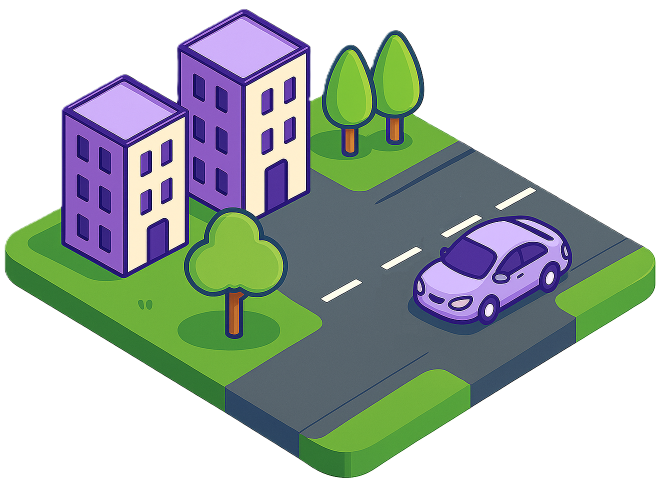

  
  <h1>
    𝒳-Scene: Large-Scale Driving Scene Generation with High Fidelity and Flexible Controllability
  </h1>

NeurIPS 2025




## Abstract

  

  

  Overview of 𝒳-Scene, a unified world generator that supports multi-granular controllability through high-level text-to-layout generation and low-level BEV layout conditioning. It performs joint occupancy, image, and video generation for 3D scene synthesis and reconstruction with high fidelity.
  

Diffusion models are advancing autonomous driving by enabling realistic data synthesis, predictive end-to-end planning, and closed-loop simulation, with a primary focus on temporally consistent generation. However, large-scale 3D scenes requiring spatial coherence remains underexplored.

In this paper, we present 𝒳-Scene, a novel framework for large-scale driving scene generation that achieves geometric intricacy, appearance fidelity, and flexible controllability.

Specifically, 𝒳-Scene supports multi-granular control, including low-level layout conditioning driven by user input or text for detailed scene composition, and high-level semantic guidance informed by user intent and LLM-enriched prompts for efficient customization.

To enhance geometric and visual fidelity, we introduce a unified pipeline that sequentially generates 3D semantic occupancy and corresponding multi-view images and videos, ensuring alignment and temporal consistency across modalities.

We further extend local regions into large-scale scenes via consistency-aware scene outpainting, which extrapolates occupancy and images from previously generated areas to maintain spatial and visual coherence.

The resulting scenes are lifted into high-quality 3DGS representations, supporting diverse applications such as simulation and scene exploration.

Extensive experiments demonstrate that 𝒳-Scene substantially advances controllability and fidelity in large-scale scene generation, empowering data generation and simulation for autonomous driving.

## Method

  

  

  Pipeline of 𝒳-Scene for driving scene generation: <strong>(a) Multi-granular controllability</strong> supports both high-level text prompts and low-level geometric constraints for flexible specification;  <strong>(b) Joint occupancy-image-video generation</strong> synthesizes aligned 3D voxels and multi-view images and videos via conditional diffusion; <strong>(c) Large-scale extrapolation</strong> enables coherent scene expansion through consistency-aware outpainting.
  

## Scene Generation Results

### 1. Layout Conditioned Generation

  

    <video class="video-normal" autoplay loop muted playsinline preload="metadata">
      <source src="assets/images/generation_1.webm" type="video/webm">
    </video>
  

  

    <video class="video-normal" autoplay loop muted playsinline preload="metadata">
      <source src="assets/images/generation_2.webm" type="video/webm">
    </video>
  

### 2. Text-to-Scene Generation

  <button class="toggle-btn active" onclick="showText2Scene(1)">Scene 1</button>
  <button class="toggle-btn" onclick="showText2Scene(2)">Scene 2</button>
  <button class="toggle-btn" onclick="showText2Scene(3)">Scene 3</button>
  <button class="toggle-btn" onclick="showText2Scene(4)">Scene 4</button>

  

    

      <video class="video-normal" autoplay loop muted playsinline preload="metadata">
        <source src="assets/images/text2scene_1_1.webm" type="video/webm">
      </video>
      <video class="video-normal" autoplay loop muted playsinline preload="metadata">
        <source src="assets/images/text2scene_1_2.webm" type="video/webm">
      </video>
    

  

  

    

      <video class="video-normal" autoplay loop muted playsinline preload="metadata">
        <source src="assets/images/text2scene_2_1.webm" type="video/webm">
      </video>
      <video class="video-normal" autoplay loop muted playsinline preload="metadata">
        <source src="assets/images/text2scene_2_2.webm" type="video/webm">
      </video>
    

  

  

    

      <video class="video-normal" autoplay loop muted playsinline preload="metadata">
        <source src="assets/images/text2scene_3_1.webm" type="video/webm">
      </video>
      <video class="video-normal" autoplay loop muted playsinline preload="metadata">
        <source src="assets/images/text2scene_3_2.webm" type="video/webm">
      </video>
    

  

  

    

      <video class="video-normal" autoplay loop muted playsinline preload="metadata">
        <source src="assets/images/text2scene_4_1.webm" type="video/webm">
      </video>
      <video class="video-normal" autoplay loop muted playsinline preload="metadata">
        <source src="assets/images/text2scene_4_2.webm" type="video/webm">
      </video>
    

  

### 3. Large-Scale Scene Generation

  <button class="toggle-btn active" onclick="showLargeScaleScene(1)">Scene 1</button>
  <button class="toggle-btn" onclick="showLargeScaleScene(2)">Scene 2</button>

  

    

      <video class="video-normal" autoplay loop muted playsinline preload="metadata">
        <source src="assets/images/largescale_1_1.webm" type="video/webm">
      </video>
    

    

      <video class="video-medium" autoplay loop muted playsinline preload="metadata">
        <source src="assets/images/largescale_1_2.webm" type="video/webm">
      </video>
      <video class="video-medium" autoplay loop muted playsinline preload="metadata">
        <source src="assets/images/largescale_1_3.webm" type="video/webm">
      </video>
    

  

  

    

      <video class="video-normal" autoplay loop muted playsinline preload="metadata">
        <source src="assets/images/largescale_2.webm" type="video/webm">
      </video>
    

  


